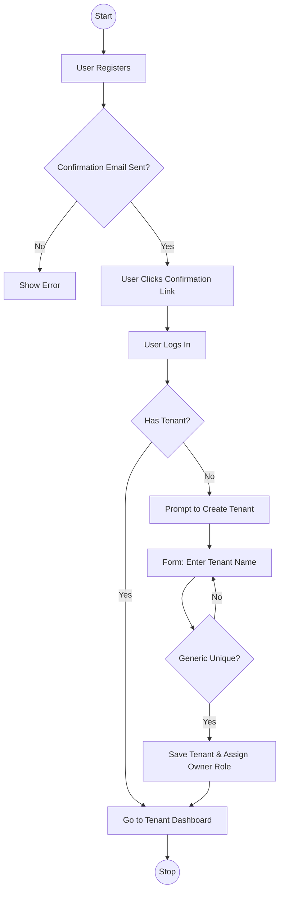

# Flowchart / Activity Diagram

## User Registration && Tenant Creation Flow

```mermaid
flowchart TD
    Start((Start)) --> Register[User Registers]
    Register --> EmailSent{Confirmation Email Sent?}
    EmailSent -- No --> Error[Show Error]
    EmailSent -- Yes --> Confirm[User Clicks Confirmation Link]
    Confirm --> Login[User Logs In]
    Login --> HasTenant{Has Tenant?}

    HasTenant -- Yes --> Dashboard[Go to Tenant Dashboard]
    HasTenant -- No --> PromptCreate[Prompt to Create Tenant]

    PromptCreate --> CreateTenant[Form: Enter Tenant Name]
    CreateTenant --> Validate{Generic Unique?}

    Validate -- No --> CreateTenant
    Validate -- Yes --> Save[Save Tenant & Assign Owner Role]
    Save --> Dashboard

    Dashboard --> Stop((Stop))
```
