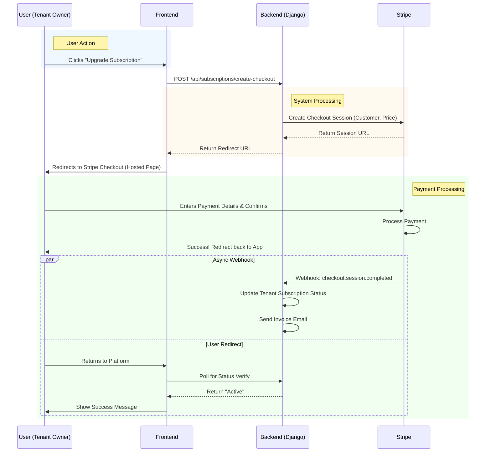

# BPMN / Swimlane Diagram

## Subscription Upgrade Process

*Note: Mermaid does not strictly support BPMN notation, so a Swimlane-style Sequence Diagram is used to depict the cross-system workflow.*
