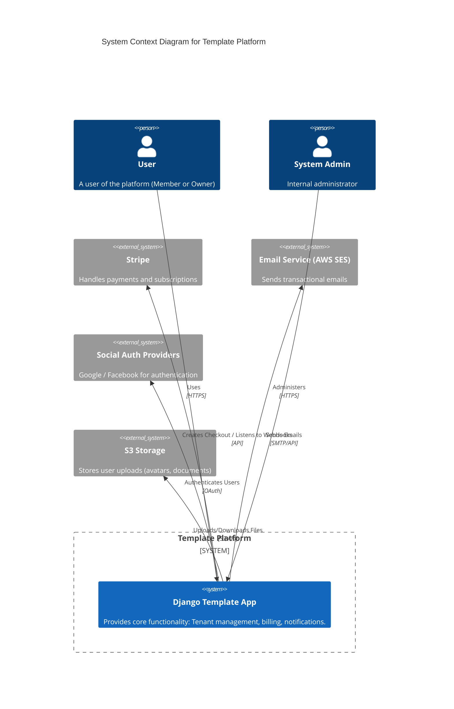

# System Context Diagram

This diagram shows the Template Platform's interaction with external systems and users.

```mermaid
C4Context
    title System Context Diagram for Template Platform

    Person(user, "User", "A user of the platform (Member or Owner)")
    Person(admin, "System Admin", "Internal administrator")

    System_Boundary(c1, "Template Platform") {
        System(system, "Django Template App", "Provides core functionality: Tenant management, billing, notifications.")
    }

    System_Ext(stripe, "Stripe", "Handles payments and subscriptions")
    System_Ext(email, "Email Service (AWS SES)", "Sends transactional emails")
    System_Ext(social, "Social Auth Providers", "Google / Facebook for authentication")
    System_Ext(storage, "S3 Storage", "Stores user uploads (avatars, documents)")

    Rel(user, system, "Uses", "HTTPS")
    Rel(admin, system, "Administers", "HTTPS")

    Rel(system, stripe, "Creates Checkout / Listens to Webhooks", "API")
    Rel(system, email, "Sends Emails", "SMTP/API")
    Rel(system, social, "Authenticates Users", "OAuth")
    Rel(system, storage, "Uploads/Downloads Files", "S3 API")
```
