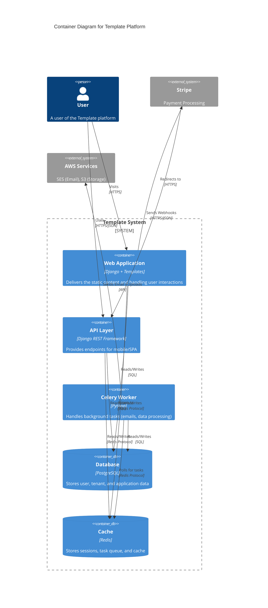

# High-Level Architecture Diagram

## C4 Container Diagram

```mermaid
C4Container
    title Container Diagram for Template Platform

    Person(user, "User", "A user of the Template platform")

    System_Boundary(c1, "Template System") {
        Container(web_app, "Web Application", "Django + Templates", "Delivers the static content and handling user interactions")
        Container(api, "API Layer", "Django REST Framework", "Provides endpoints for mobile/SPA")
        Container(worker, "Celery Worker", "Python", "Handles background tasks (emails, data processing)")

        ContainerDb(database, "Database", "PostgreSQL", "Stores user, tenant, and application data")
        ContainerDb(cache, "Cache", "Redis", "Stores sessions, task queue, and cache")
    }

    System_Ext(stripe, "Stripe", "Payment Processing")
    System_Ext(aws, "AWS Services", "SES (Email), S3 (Storage)")

    Rel(user, web_app, "Visits", "HTTPS")
    Rel(user, api, "Uses", "HTTPS/JSON")

    Rel(web_app, database, "Reads/Writes", "SQL")
    Rel(web_app, cache, "Reads/Writes", "Redis Protocol")

    Rel(api, database, "Reads/Writes", "SQL")
    Rel(api, cache, "Reads/Writes", "Redis Protocol")

    Rel(worker, cache, "Polls for tasks", "Redis Protocol")
    Rel(worker, database, "Reads/Writes", "SQL")

    Rel(web_app, stripe, "Redirects to", "HTTPS")
    Rel(worker, aws, "Sends Email / Uploads", "API")
    Rel(stripe, api, "Sends Webhooks", "HTTPS/JSON")
```
