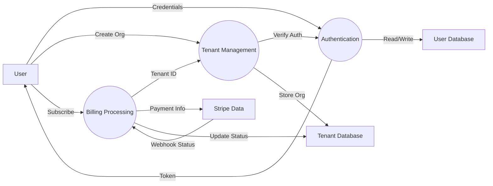

# Data Flow Diagram (DFD)

## Level 1 DFD: User Interaction & Payment

```mermaid
graph LR
    User[User]
    Process1((Authentication))
    Process2((Tenant Management))
    Process3((Billing Processing))
    DS1[User Database]
    DS2[Tenant Database]
    DS3[Stripe Data]

    User -->|Credentials| Process1
    Process1 -->|Token| User
    Process1 -->|Read/Write| DS1

    User -->|Create Org| Process2
    Process2 -->|Verify Auth| Process1
    Process2 -->|Store Org| DS2

    User -->|Subscribe| Process3
    Process3 -->|Tenant ID| Process2
    Process3 -->|Payment Info| DS3
    DS3 -->|Webhook Status| Process3
    Process3 -->|Update Status| DS2
```
