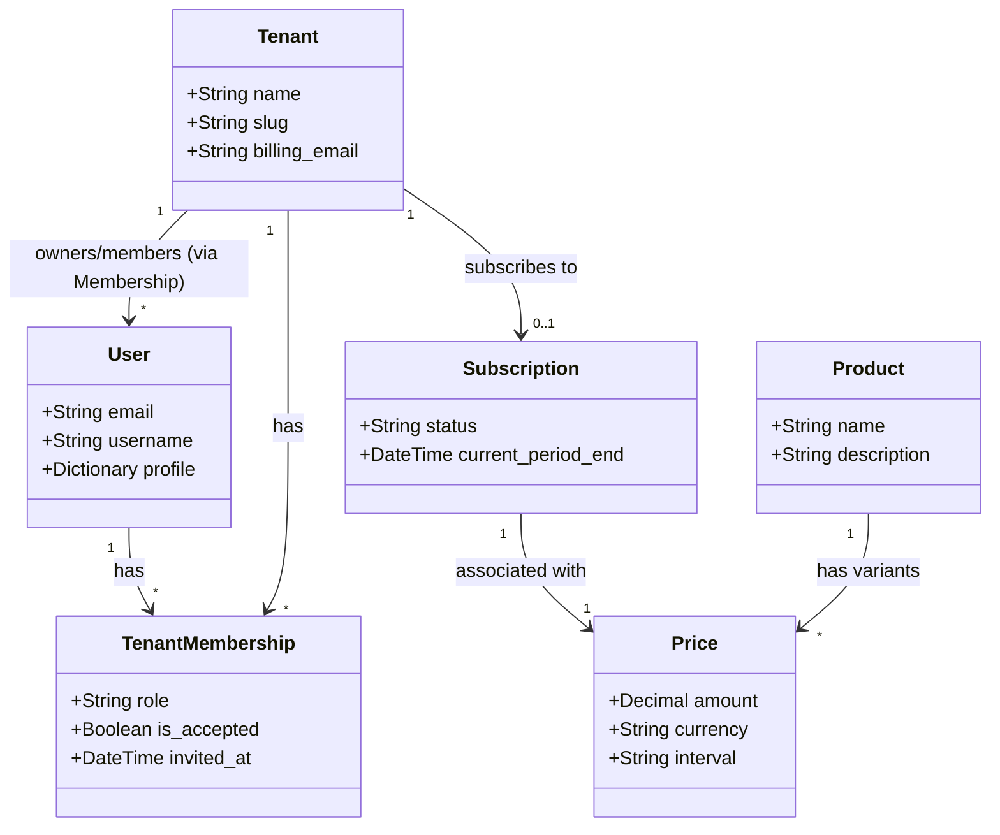

# Domain Model

```mermaid
classDiagram
    direction TB

    class User {
        +String email
        +String username
        +Dictionary profile
    }

    class Tenant {
        +String name
        +String slug
        +String billing_email
    }

    class TenantMembership {
        +String role
        +Boolean is_accepted
        +DateTime invited_at
    }

    class Subscription {
        +String status
        +DateTime current_period_end
    }

    class Product {
        +String name
        +String description
    }

    class Price {
        +Decimal amount
        +String currency
        +String interval
    }

    User "1" --> "*" TenantMembership : has
    Tenant "1" --> "*" TenantMembership : has
    Tenant "1" --> "0..1" Subscription : subscribes to
    Subscription "1" --> "1" Price : associated with
    Product "1" --> "*" Price : has variants
    Tenant "1" --> "*" User : owners/members (via Membership)
```
