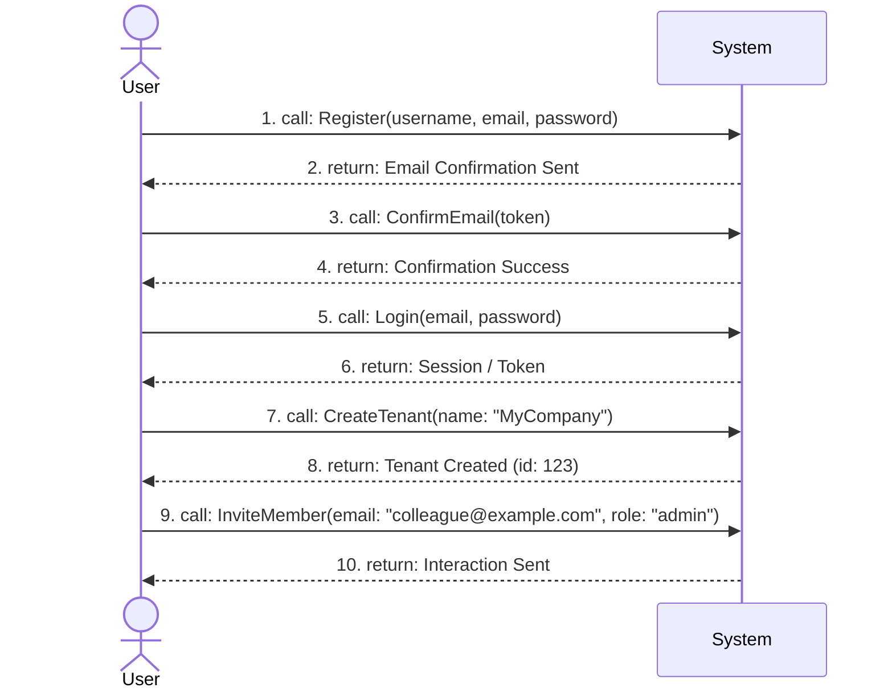

# System Sequence Diagram

## Register and Create Tenant

```mermaid
sequenceDiagram
    actor U as User
    participant S as System

    U->>S: 1. call: Register(username, email, password)
    S-->>U: 2. return: Email Confirmation Sent

    U->>S: 3. call: ConfirmEmail(token)
    S-->>U: 4. return: Confirmation Success

    U->>S: 5. call: Login(email, password)
    S-->>U: 6. return: Session / Token

    U->>S: 7. call: CreateTenant(name: "MyCompany")
    S-->>U: 8. return: Tenant Created (id: 123)

    U->>S: 9. call: InviteMember(email: "colleague@example.com", role: "admin")
    S-->>U: 10. return: Interaction Sent
```
