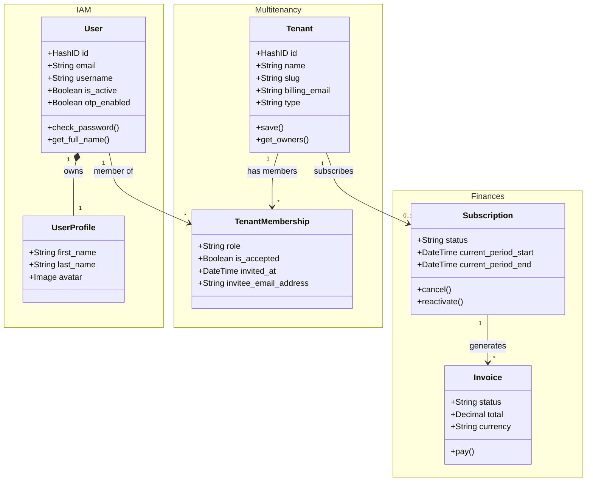

# detailed Class Diagram

```mermaid
classDiagram
    direction TB

    namespace IAM {
        class User {
            +HashID id
            +String email
            +String username
            +Boolean is_active
            +Boolean otp_enabled
            +check_password()
            +get_full_name()
        }

        class UserProfile {
            +String first_name
            +String last_name
            +Image avatar
        }
    }

    namespace Multitenancy {
        class Tenant {
            +HashID id
            +String name
            +String slug
            +String billing_email
            +String type
            +save()
            +get_owners()
        }

        class TenantMembership {
            +String role
            +Boolean is_accepted
            +DateTime invited_at
            +String invitee_email_address
        }
    }

    namespace Finances {
        class Subscription {
            +String status
            +DateTime current_period_start
            +DateTime current_period_end
            +cancel()
            +reactivate()
        }

        class Invoice {
            +String status
            +Decimal total
            +String currency
            +pay()
        }
    }

    User "1" *-- "1" UserProfile : owns
    User "1" --> "*" TenantMembership : member of
    Tenant "1" --> "*" TenantMembership : has members
    Tenant "1" --> "0..1" Subscription : subscribes
    Subscription "1" --> "*" Invoice : generates
```
