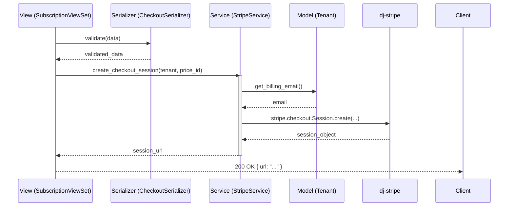

# Internal Sequence Diagram

## Create Checkout Session (Code Level)

```mermaid
sequenceDiagram
    participant V as View (SubscriptionViewSet)
    participant S as Serializer (CheckoutSerializer)
    participant Sv as Service (StripeService)
    participant M as Model (Tenant)
    participant Lib as dj-stripe

    V->>S: validate(data)
    S-->>V: validated_data

    V->>Sv: create_checkout_session(tenant, price_id)
    activate Sv

    Sv->>M: get_billing_email()
    M-->>Sv: email

    Sv->>Lib: stripe.checkout.Session.create(...)
    Lib-->>Sv: session_object

    Sv-->>V: session_url
    deactivate Sv

    V-->>Client: 200 OK { url: "..." }
```
