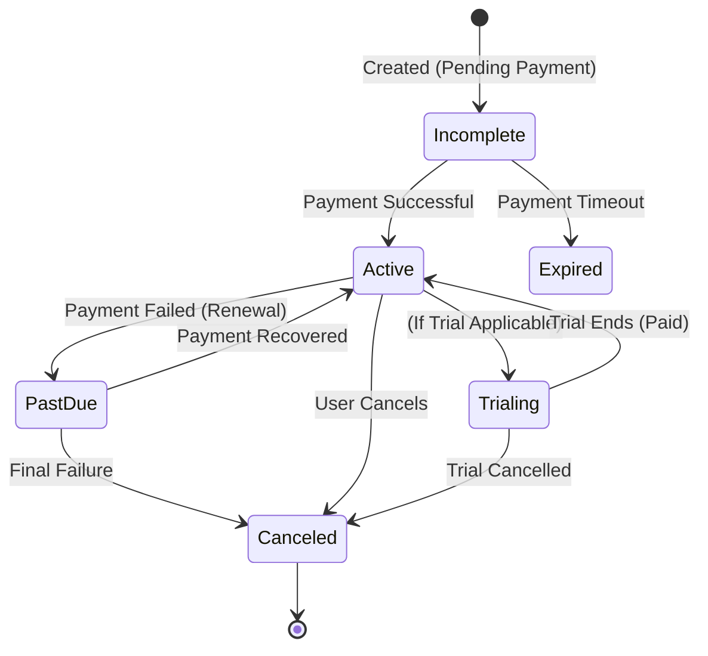
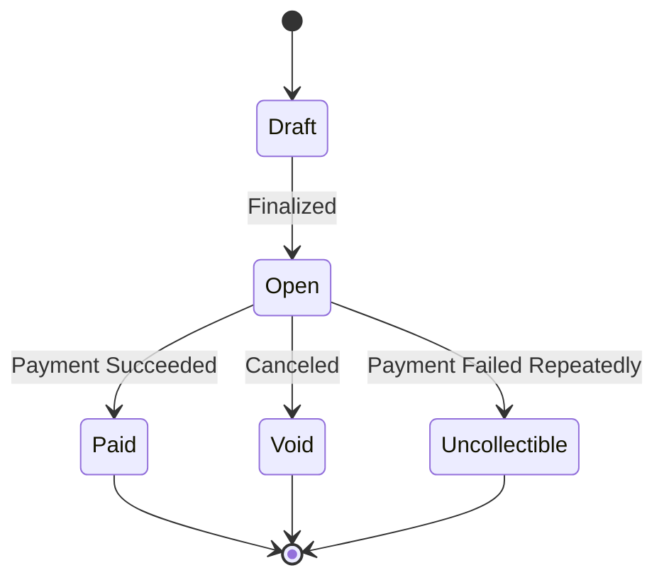

# State Machine Diagram

## Subscription Lifecycle

```mermaid
stateDiagram-v2
    [*] --> Incomplete: Created (Pending Payment)
    Incomplete --> Active: Payment Successful
    Incomplete --> Expired: Payment Timeout

    Active --> PastDue: Payment Failed (Renewal)
    PastDue --> Active: Payment Recovered
    PastDue --> Canceled: Final Failure

    Active --> Canceled: User Cancels
    Canceled --> [*]

    Active --> Trialing: (If Trial Applicable)
    Trialing --> Active: Trial Ends (Paid)
    Trialing --> Canceled: Trial Cancelled
```

## Invoice Lifecycle

```mermaid
stateDiagram-v2
    [*] --> Draft
    Draft --> Open: Finalized
    Open --> Paid: Payment Succeeded
    Open --> Void: Canceled
    Open --> Uncollectible: Payment Failed Repeatedly
    Paid --> [*]
    Void --> [*]
    Uncollectible --> [*]
```
