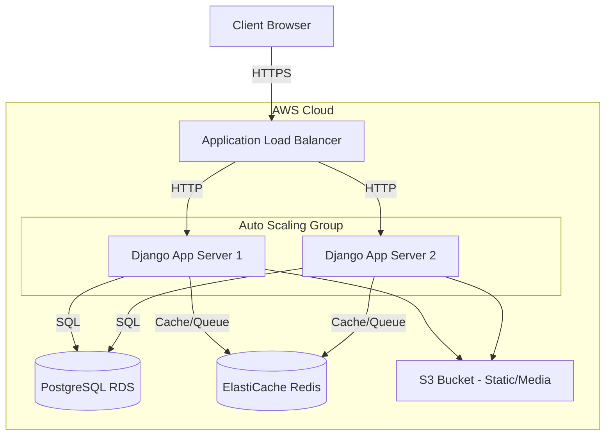
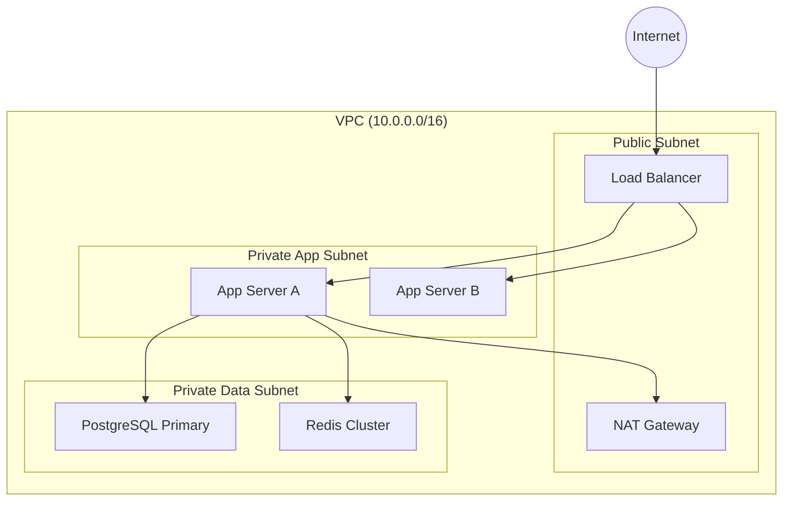

# Infrastructure Diagrams

## Deployment Diagram

```mermaid
graph TD
    subgraph "AWS Cloud"
        LB[Application Load Balancer]

        subgraph "Auto Scaling Group"
            EC2_1[Django App Server 1]
            EC2_2[Django App Server 2]
        end

        RDS[(PostgreSQL RDS)]
        Redis[(ElastiCache Redis)]
        S3[S3 Bucket - Static/Media]
    end

    User[Client Browser] -->|HTTPS| LB
    LB -->|HTTP| EC2_1
    LB -->|HTTP| EC2_2

    EC2_1 -->|SQL| RDS
    EC2_2 -->|SQL| RDS

    EC2_1 -->|Cache/Queue| Redis
    EC2_2 -->|Cache/Queue| Redis

    EC2_1 -->S3
    EC2_2 -->S3
```

## Network Diagram (VPC)

```mermaid
graph TB
    subgraph "VPC (10.0.0.0/16)"

        subgraph "Public Subnet"
            ALB[Load Balancer]
            NAT[NAT Gateway]
        end

        subgraph "Private App Subnet"
            App1[App Server A]
            App2[App Server B]
        end

        subgraph "Private Data Subnet"
            DB[PostgreSQL Primary]
            Cache[Redis Cluster]
        end
    end

    Internet((Internet)) --> ALB
    ALB --> App1
    ALB --> App2

    App1 --> NAT
    App1 --> DB
    App1 --> Cache
```
