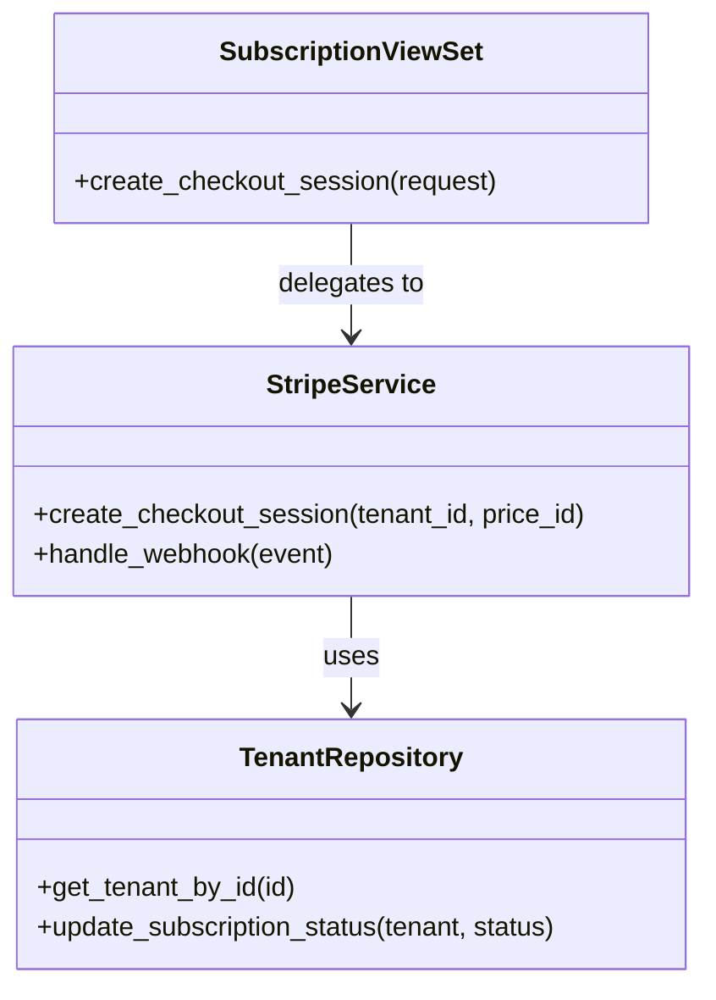

# Implementation Details

## C4 Code Diagram (Class Level)

Focusing on the **Subscription Checkout Flow**.

## Implementation Strategy

The implementation follows the **adapters structure**:
- **Core Domain Logic** stays in `apps/<name>/services/`.
- **Framework Glue** (Views/Serializers) stays in `apps/<name>/api/`.
- **External Integrations** (Stripe/AWS) use the Adapter pattern to keep the core logic testable.
